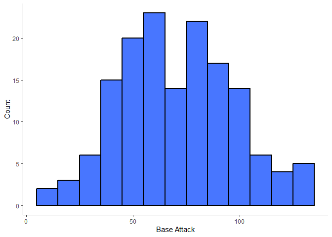
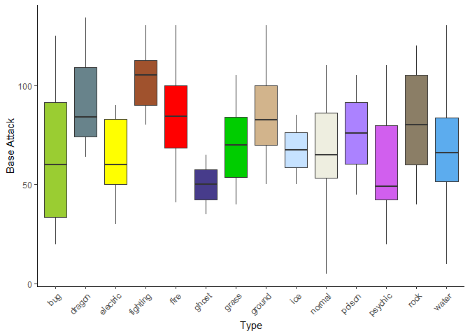
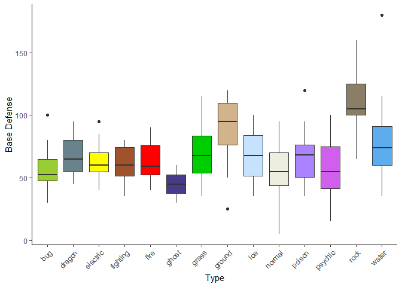
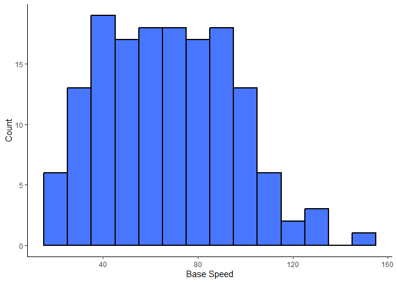
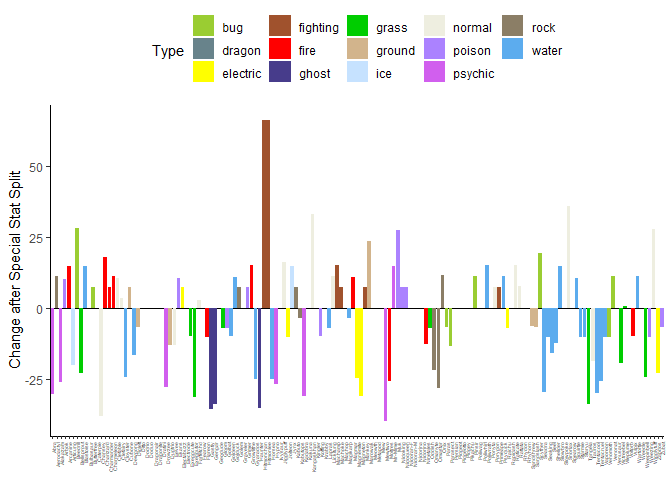
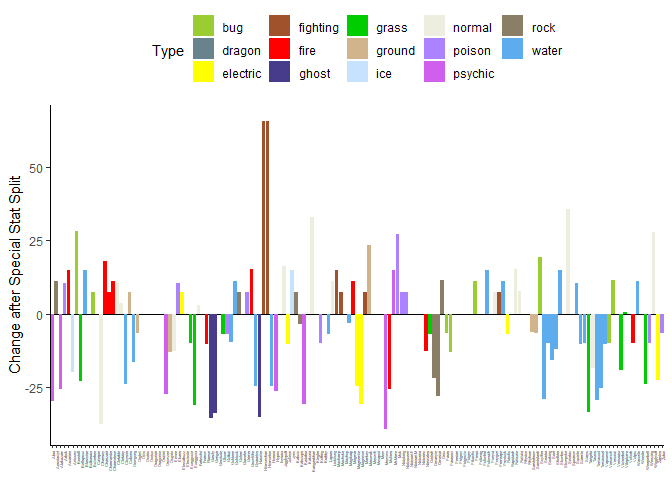

Project-1
================
Damon D’Ambrosio
2023-06-23

- <a href="#requirements" id="toc-requirements">Requirements</a>
- <a href="#api-interaction-custom-functions"
  id="toc-api-interaction-custom-functions">API Interaction Custom
  Functions</a>
  - <a href="#pokemonlookup"
    id="toc-pokemonlookup"><code>pokemon.lookup</code></a>
  - <a href="#pokemonvector"
    id="toc-pokemonvector"><code>pokemon.vector</code></a>
  - <a href="#gen1correction"
    id="toc-gen1correction"><code>gen1.correction</code></a>
  - <a href="#pokemonbatchreport"
    id="toc-pokemonbatchreport"><code>pokemon.batch.report</code></a>
- <a href="#data-exploration" id="toc-data-exploration">Data
  Exploration</a>
  - <a href="#pokemon-type-frequency-breakdown"
    id="toc-pokemon-type-frequency-breakdown">Pokemon type frequency
    breakdown</a>
  - <a href="#height-and-weight" id="toc-height-and-weight">Height and
    Weight</a>
  - <a href="#base-stats" id="toc-base-stats">Base Stats</a>
- <a href="#conclusion" id="toc-conclusion">Conclusion</a>

## Requirements

Packages required to run the functions are as follows:  
- `tidyverse`: All manner of good things for manipulating and analyzing
data  
- `httr`: Connecting to the API  
- `jsonlite`: Getting usable information from the API

## API Interaction Custom Functions

### `pokemon.lookup`

The first custom function we have is `pokemon.lookup`. This function
receives an input, either in the form of a Pokemon’s name or ID number,
and returns a nice, neat, one-row tibble displaying the desired
information for that individual Pokemon. PokeApi does not require a key,
so queries are accomplished by simply pasting the input query to the end
of the necessary hyperlink to look up the information. Name queries on
PokeApi are case-sensitive and lowercase only, so some language is
provided in the function to allow the user to enter the Pokemon name
however they see fit. By default, PokeApi stores Pokemon height and
weight in decimeters and hectograms, respectively. I have a hard enough
time conceptualizing metric units, and these particular units do not
match those used in any of the Pokemon-related media I remember from my
youth. Similarly, they do not match the units used in Pokemon-related
media made for consumption outside of the United States. As such, an
optional `unit` argument exists, which will convert the height and
weight into imperial units (inches and pounds) or metric units (meters
and kilograms). `pokemon.lookup` is a nice standalone function, but will
also serve as a helper function to generate larger reports.

``` r
pokemon.lookup <- function(x, unit = NULL, ...){
  poke.query <- paste0("https://pokeapi.co/api/v2/pokemon/", str_to_lower(x))
  
  poke.get <- GET(poke.query)
  
  poke.char <- fromJSON(rawToChar(poke.get$content))
  
  name <- str_to_title(poke.char$name)
  id.number <- poke.char$id
  type1 <- poke.char$types$type$name[1]
  type2 <- poke.char$types$type$name[2]
  height <- poke.char$height
  weight <- poke.char$weight
  hp <- poke.char$stats$base_stat[1]
  attack <- poke.char$stats$base_stat[2]
  defense <- poke.char$stats$base_stat[3]
  special.attack <- poke.char$stats$base_stat[4]
  special.defense <- poke.char$stats$base_stat[5]
  speed <- poke.char$stats$base_stat[6]
  
  if("imperial" %in% unit){
    height <- round((height * 3.93700787))
    weight <- round((weight * 0.2204622622))
  }
  
  if("metric" %in% unit){
    height <- round((height/10), 1)
    weight <- round((weight/10), 1)
  }

  poke.table <- tibble(name = name,
                       id.number = id.number,
                       type1 = type1,
                       type2 = type2,
                       height = height,
                       weight = weight,
                       hp = hp,
                       attack = attack,
                       defense = defense,
                       special.attack = special.attack,
                       special.defense = special.defense,
                       speed = speed
                )
return(poke.table)
}
```

Lets test it out. My favorite Pokemon as a kid was Rhydon, so let’s make
a query for Rhydon, using imperial units:

``` r
pokemon.lookup("rhydon", unit = "imperial")
```

<div data-pagedtable="false">

<script data-pagedtable-source type="application/json">
{"columns":[{"label":["name"],"name":[1],"type":["chr"],"align":["left"]},{"label":["id.number"],"name":[2],"type":["int"],"align":["right"]},{"label":["type1"],"name":[3],"type":["chr"],"align":["left"]},{"label":["type2"],"name":[4],"type":["chr"],"align":["left"]},{"label":["height"],"name":[5],"type":["dbl"],"align":["right"]},{"label":["weight"],"name":[6],"type":["dbl"],"align":["right"]},{"label":["hp"],"name":[7],"type":["int"],"align":["right"]},{"label":["attack"],"name":[8],"type":["int"],"align":["right"]},{"label":["defense"],"name":[9],"type":["int"],"align":["right"]},{"label":["special.attack"],"name":[10],"type":["int"],"align":["right"]},{"label":["special.defense"],"name":[11],"type":["int"],"align":["right"]},{"label":["speed"],"name":[12],"type":["int"],"align":["right"]}],"data":[{"1":"Rhydon","2":"112","3":"ground","4":"rock","5":"75","6":"265","7":"105","8":"130","9":"120","10":"45","11":"45","12":"40"}],"options":{"columns":{"min":{},"max":[10]},"rows":{"min":[10],"max":[10]},"pages":{}}}
  </script>

</div>

Now lets demonstrate how it functions with using a numeric Pokemon ID
and metric units. How about one of the 300 first Pokemon, selected
randomly?

``` r
pokemon.lookup(sample(1:300,1), unit = "metric")
```

<div data-pagedtable="false">

<script data-pagedtable-source type="application/json">
{"columns":[{"label":["name"],"name":[1],"type":["chr"],"align":["left"]},{"label":["id.number"],"name":[2],"type":["int"],"align":["right"]},{"label":["type1"],"name":[3],"type":["chr"],"align":["left"]},{"label":["type2"],"name":[4],"type":["chr"],"align":["left"]},{"label":["height"],"name":[5],"type":["dbl"],"align":["right"]},{"label":["weight"],"name":[6],"type":["dbl"],"align":["right"]},{"label":["hp"],"name":[7],"type":["int"],"align":["right"]},{"label":["attack"],"name":[8],"type":["int"],"align":["right"]},{"label":["defense"],"name":[9],"type":["int"],"align":["right"]},{"label":["special.attack"],"name":[10],"type":["int"],"align":["right"]},{"label":["special.defense"],"name":[11],"type":["int"],"align":["right"]},{"label":["speed"],"name":[12],"type":["int"],"align":["right"]}],"data":[{"1":"Masquerain","2":"284","3":"bug","4":"flying","5":"0.8","6":"3.6","7":"70","8":"60","9":"62","10":"100","11":"82","12":"80"}],"options":{"columns":{"min":{},"max":[10]},"rows":{"min":[10],"max":[10]},"pages":{}}}
  </script>

</div>

The ultimate plan is to use `lapply` on `pokemon.lookup` to generate
large reports for analysis. However, there is some functionality I would
like to add. Namely, I do not have Pokemon ID numbers memorized. I do
remember Pokemon names, however. As such, it would be nice if I could
simply request all Pokemon between “Pokemon A” and “Pokemon B” using
names, and have the function handle looking up the ID, constructing the
vector, then feeding it to `lapply`. The next custom function deals with
that.

### `pokemon.vector`

`pokemon.vector` allows one to provide the names of two Pokemon (via a
character vector with length = 2), and returns a vector of the ID
numbers between said Pokemon. This vector can then be fed to
`pokemon.lookup` via `lapply` to generate a report of multiple Pokemon.

``` r
pokemon.vector <- function(x, ...){
  
  if(is.numeric(x)){
    stop("Expecting two Pokemon names, not numbers!")
  }
  
  if(length(x) > 2){
    stop("Expecting exactly two Pokemon names!")
  }
  
  poke.1 <- str_to_lower(x[1])
  poke.2 <- str_to_lower(x[2])
  
  poke.1.query <- paste0("https://pokeapi.co/api/v2/pokemon/", poke.1)
  poke.1.get <- GET(poke.1.query)
  poke.1.char <- fromJSON(rawToChar(poke.1.get$content))
  poke.1.id <- poke.1.char$id
  
  poke.2.query <- paste0("https://pokeapi.co/api/v2/pokemon/", poke.2)
  poke.2.get <- GET(poke.2.query)
  poke.2.char <- fromJSON(rawToChar(poke.2.get$content))
  poke.2.id <- poke.2.char$id
  
  poke.vec <- seq(poke.1.id, poke.2.id)
  return(poke.vec)
}
```

Now, a quick demonstration of `pokemon.vector` in action. Let’s get a
numeric vector of all Pokemon IDs of the Generation III Pokemon.
“Treecko” is the first Generation III Pokemon, and “Jirachi” is the last
Generation III Pokemon:

``` r
gen3.list <- c("Treecko", "Jirachi")
pokemon.vector(gen3.list)
```

    ##   [1] 252 253 254 255 256 257 258 259 260 261 262 263 264 265 266 267 268 269 270 271 272 273 274 275 276 277 278 279 280 281 282 283 284 285 286
    ##  [36] 287 288 289 290 291 292 293 294 295 296 297 298 299 300 301 302 303 304 305 306 307 308 309 310 311 312 313 314 315 316 317 318 319 320 321
    ##  [71] 322 323 324 325 326 327 328 329 330 331 332 333 334 335 336 337 338 339 340 341 342 343 344 345 346 347 348 349 350 351 352 353 354 355 356
    ## [106] 357 358 359 360 361 362 363 364 365 366 367 368 369 370 371 372 373 374 375 376 377 378 379 380 381 382 383 384 385

One last helper function before we wrap things up…

### `gen1.correction`

The Pokemon games have changed a lot from since I was a kid. Some of
these changes were to correct “balance” issues. The two major changes
that come to mind are as follows:

- New Pokemon “types” have been added since Generation I to correct
  imbalances in the strengths/weaknesses of the various Pokemon. “Steel”
  and “Dark” types were added in Generation II, and at some point in
  time, “Fairy” was also added as a type. Seven Generation I Pokemon
  retroactively had their types changed as a result. I would like to do
  an exploratory data analysis on the Pokemon as they existed in
  Generation I, so would need to correct these Pokemon to their “old”
  typing.

- As can be seen earlier in this vignette, Pokemon have a “special
  attack” and “special defense” stat. In Generation I, these were
  combined into a single stat called “special.” From what I can tell,
  the original “Special” stat does not exist in PokeApi. However, it can
  exist within R as a simple numeric vector with 151 values. The
  `gen1.correction` function will store and provide that information.

``` r
gen1.correction <- function(x, type.change = TRUE, add.special = TRUE, delete.sp.att.def = FALSE, ...){

y <- x %>% filter(id.number <= 151)
z <- x %>% filter(id.number > 151)

  if(isTRUE(type.change)){
    y$type1[y$type1 == "fairy"] <- "normal" #Corrects Clefairy and Clefable to Gen I typing
    y$type2[y$type2 == "fairy"] <- NA       #Corrects Jigglypuff, Wigglytuff, and Mr-Mime to Gen I typing
    y$type2[y$type2 == "steel"] <- NA       #Corrects Magnemite and Magneton to Gen I typing
    
    if(max(x$id.number) > 151){
      warning("Pokemon that did not exist in Generation I are in this report. The typing scheme in this report is now inconsistent")
    }
  }
  
  if(isTRUE(add.special)){
  
  #Special stat values sourced from bulbapedia.bulbagarden.net
  special.vector <- c(65, 80, 100, 50, 65, 85, 50, 65, 85, 20, 25, 80, 20, 25, 45, 35, 50, 70, 25, 50, 31, 61, 40, 65, 50, 90, 30, 55, 40, 55,   75, 40, 55, 75, 60, 85, 65, 100, 25, 50, 40, 75, 75, 85, 100, 55, 80, 40, 90, 45, 70, 40, 65, 50, 80, 35, 60, 50, 80, 40, 50, 70, 105, 120,   135, 35, 50, 65, 70, 85, 100, 100, 120, 30, 45, 55, 65, 80, 40, 80, 95, 120, 58, 35, 60, 70, 95, 40, 65, 45, 85, 100, 115, 130, 30, 90, 115,   25, 50, 55, 80, 60, 125, 40, 50, 35, 35, 60, 60, 85, 30, 45, 105, 100, 40, 70, 95, 50, 80, 70, 100, 100, 55, 95, 85, 85, 55, 70, 20, 100,     95, 48, 65, 110, 110, 110, 75, 90, 115, 45, 70, 60, 65, 125, 125, 125, 50, 70, 100, 154, 100)

  y <- y %>% mutate(gen1.special = special.vector[y$id.number])
  }

new.report <- bind_rows(y,z)

  if(isTRUE(delete.sp.att.def)){
    if(max(new.report$id.number > 151)){
      warning("Pokemon that did not exist in Generation I are in this report. Are you sure you wanted to delete special attack and special defense?")
    }
  new.report <- new.report %>% select(-c(special.attack, special.defense))
  }
return(new.report)
}
```

`gen1.correction` will check that Pokemon belong to Generation I by
making sure their ID number is 151 or lower. It will then change types
if needed, and append the “Special” stat to that Pokemon’s record. If a
type change is requested and Pokemon that did not exist in Generation I
are included in the provided data set, a warning message will notify the
user that the overall type scheme is inconsistent. The user can also
delete “Special Attack” and “Special Defense” if they wish to have a
“pure” Generation I dataset. If Pokemon that did not exist in Generation
I is included in the provided data set and the user specifies dropping
“Special Attack” and “Special Defense,” a warning message will appear,
as the resultant data set will have no “special” data associated with
such records.

Here’s a quick example. Let’s build a simple data set containing two
Pokemon: Magnemite, a Generation I Pokemon who would need a type
correction to remove its secondary “Steel” typing, and Scizor, a
Generation II Pokemon who does not need a type correction, but would be
inadvertently “corrected” if the function did not work as intended.
We’ll also specify the function to delete Special Attack and Special
Defense to see both potential warning messages:

``` r
a <- pokemon.lookup("Magnemite")
b <- pokemon.lookup("Scizor")
c <- bind_rows(a,b)

gen1.correction(c, delete.sp.att.def = TRUE)
```

    ## Warning in gen1.correction(c, delete.sp.att.def = TRUE): Pokemon that did not exist in Generation I are in this report. The typing scheme in
    ## this report is now inconsistent

    ## Warning in gen1.correction(c, delete.sp.att.def = TRUE): Pokemon that did not exist in Generation I are in this report. Are you sure you wanted
    ## to delete special attack and special defense?

<div data-pagedtable="false">

<script data-pagedtable-source type="application/json">
{"columns":[{"label":["name"],"name":[1],"type":["chr"],"align":["left"]},{"label":["id.number"],"name":[2],"type":["int"],"align":["right"]},{"label":["type1"],"name":[3],"type":["chr"],"align":["left"]},{"label":["type2"],"name":[4],"type":["chr"],"align":["left"]},{"label":["height"],"name":[5],"type":["int"],"align":["right"]},{"label":["weight"],"name":[6],"type":["int"],"align":["right"]},{"label":["hp"],"name":[7],"type":["int"],"align":["right"]},{"label":["attack"],"name":[8],"type":["int"],"align":["right"]},{"label":["defense"],"name":[9],"type":["int"],"align":["right"]},{"label":["speed"],"name":[10],"type":["int"],"align":["right"]},{"label":["gen1.special"],"name":[11],"type":["dbl"],"align":["right"]}],"data":[{"1":"Magnemite","2":"81","3":"electric","4":"NA","5":"3","6":"60","7":"25","8":"35","9":"70","10":"45","11":"95"},{"1":"Scizor","2":"212","3":"bug","4":"steel","5":"18","6":"1180","7":"70","8":"130","9":"100","10":"65","11":"NA"}],"options":{"columns":{"min":{},"max":[10]},"rows":{"min":[10],"max":[10]},"pages":{}}}
  </script>

</div>

As we can see, Magnemite had its secondary Steel type assigned to NA,
while Scizor retained its secondary Steel type. A warning message was
printed since a Pokemon outside of Generation I was in the report while
Special Attack and Special Defense were deleted. Finally, Scizor does
not have a `gen1.special` value.

### `pokemon.batch.report`

The final step is to put all of these functions into a nice wrapper,
generate some data, and start an exploratory analysis.

``` r
pokemon.batch.report <- function(x, gen1.correct = FALSE, ...){
  if(!is.numeric(x)){
    if(length(x) > 1){
    x <- pokemon.vector(x)
    }
  }
  
  x <- lapply(x, pokemon.lookup, ...)
  
  batch.lookup <- bind_rows(x)
  
  if(isTRUE(gen1.correct)){
    batch.lookup <- gen1.correction(batch.lookup, ... )
  }
  
  return(batch.lookup)
  
}
```

Now to use `pokemon.batch.report` to generate some data for exploratory
analysis. As a millennial approaching middle age, the Generation I
Pokemon and the games they appeared in are nearest and dearest to my
heart. As such, I want the original 151 Pokemon (Bulbasaur through Mew).
While one *could* supply `pokemon.batch.report` with a vector like
`x <- 1:151` to generate these data, I will supply the two Pokemon names
to take advantage of the `pokemon.vector` helper function. I will
request imperial units, and have the data “corrected” to reflect
Generation I typing. For part of the exploratory analysis, I would like
to compare how the change from a “special” stat to a separate “special
attack” and “special defense” impacted the overall abilities of each
Pokemon. As such, I will retain “special attack” and “special defense”
when applying the Generation I correction.

``` r
#To test the full capabilities of the wrapper, we will provide it with a vector of two Pokemon names instead of ID numbers
my.data <- pokemon.batch.report(c("Bulbasaur","Mew"), gen1.correct = TRUE, unit = "imperial")

print(my.data)
```

    ## # A tibble: 151 × 13
    ##    name       id.number type1 type2  height weight    hp attack defense special.attack special.defense speed gen1.special
    ##    <chr>          <int> <chr> <chr>   <dbl>  <dbl> <int>  <int>   <int>          <int>           <int> <int>        <dbl>
    ##  1 Bulbasaur          1 grass poison     28     15    45     49      49             65              65    45           65
    ##  2 Ivysaur            2 grass poison     39     29    60     62      63             80              80    60           80
    ##  3 Venusaur           3 grass poison     79    220    80     82      83            100             100    80          100
    ##  4 Charmander         4 fire  <NA>       24     19    39     52      43             60              50    65           50
    ##  5 Charmeleon         5 fire  <NA>       43     42    58     64      58             80              65    80           65
    ##  6 Charizard          6 fire  flying     67    200    78     84      78            109              85   100           85
    ##  7 Squirtle           7 water <NA>       20     20    44     48      65             50              64    43           50
    ##  8 Wartortle          8 water <NA>       39     50    59     63      80             65              80    58           65
    ##  9 Blastoise          9 water <NA>       63    188    79     83     100             85             105    78           85
    ## 10 Caterpie          10 bug   <NA>       12      6    45     30      35             20              20    45           20
    ## # ℹ 141 more rows

## Data Exploration

### Pokemon type frequency breakdown

Lets start with a contingency table. One of the criticisms of the
Generation I games was the distribution of Pokemon typing; some types
had many Pokemon, whereas others had very little. Pokemon always have at
least one type, and can have up to two types. Let’s see how that
breakdown actually looks:

``` r
#Including useNA option to return Pokemon with no secondary typing
type.table <- table(my.data$type1, my.data$type2, useNA = "ifany")

print(type.table)
```

    ##           
    ##            fighting flying grass ground ice poison psychic rock water <NA>
    ##   bug             0      2     2      0   0      5       0    0     0    3
    ##   dragon          0      1     0      0   0      0       0    0     0    2
    ##   electric        0      1     0      0   0      0       0    0     0    8
    ##   fighting        0      0     0      0   0      0       0    0     0    7
    ##   fire            0      2     0      0   0      0       0    0     0   10
    ##   ghost           0      0     0      0   0      3       0    0     0    0
    ##   grass           0      0     0      0   0      9       2    0     0    1
    ##   ground          0      0     0      0   0      0       0    2     0    6
    ##   ice             0      1     0      0   0      0       1    0     0    0
    ##   normal          0      8     0      0   0      0       0    0     0   16
    ##   poison          0      2     0      2   0      0       0    0     0   10
    ##   psychic         0      0     0      0   0      0       0    0     0    8
    ##   rock            0      1     0      4   0      0       0    0     4    0
    ##   water           1      1     0      0   3      2       3    0     0   18

The table shows this claim has some merit. There are no “pure” (i.e,
`type2` = `NA`) Ghost-, Ice-, or Rock-type Pokemon in Generation I.
Conversely, there are many “pure” Water-, Normal-, Poison-, and
Fire-type Pokemon. Let’s generate some percent totals to better explore
type frequency. First, lets get the row sums of the above table, and
calculate the percent of the 151 total Generation I Pokemon that had a
particular type as their primary type (`type1`):

``` r
type1.table <- type.table %>%
  as.data.frame() %>%
    as_tibble %>%
      rename(type1 = Var1, type2 = Var2) %>%
        group_by(type1) %>%
          summarize(total = sum(Freq)) %>%
            mutate(pct.total = round(((total/151)*100),1)) %>%
              arrange(desc(pct.total))

print(type1.table)
```

    ## # A tibble: 14 × 3
    ##    type1    total pct.total
    ##    <fct>    <int>     <dbl>
    ##  1 water       28      18.5
    ##  2 normal      24      15.9
    ##  3 poison      14       9.3
    ##  4 bug         12       7.9
    ##  5 fire        12       7.9
    ##  6 grass       12       7.9
    ##  7 electric     9       6  
    ##  8 rock         9       6  
    ##  9 ground       8       5.3
    ## 10 psychic      8       5.3
    ## 11 fighting     7       4.6
    ## 12 dragon       3       2  
    ## 13 ghost        3       2  
    ## 14 ice          2       1.3

As we can see, a whopping 28 Generation I Pokemon (\~18.5%) had Water as
their primary type. Conversely, there were only 2 Pokemon with Ice as
their primary type (\~1.3%). Let’s repeat the process for the secondary
type (`type2`):

``` r
type2.table <- type.table %>%
  as.data.frame() %>%
    as_tibble %>%
      rename(type1 = Var1, type2 = Var2) %>%
        group_by(type2) %>%
          summarize(total = sum(Freq)) %>%
            mutate(pct.total = round(((total/151)*100),1)) %>%
              arrange(desc(pct.total))

print(type2.table)
```

    ## # A tibble: 10 × 3
    ##    type2    total pct.total
    ##    <fct>    <int>     <dbl>
    ##  1 <NA>        89      58.9
    ##  2 flying      19      12.6
    ##  3 poison      19      12.6
    ##  4 ground       6       4  
    ##  5 psychic      6       4  
    ##  6 water        4       2.6
    ##  7 ice          3       2  
    ##  8 grass        2       1.3
    ##  9 rock         2       1.3
    ## 10 fighting     1       0.7

As we can see, the majority of Generation I Pokemon do not have a
secondary type (i.e., `type2` = `NA`). Flying and Poison are tied for
the most common secondary type. Flying was not a type that appeared in
our type1 table, and Normal was not a type that appeared in our type2
table. This indicates some types in Generation I only exist as primary
types, whereas others only exist as secondary types. Let’s see which
types fall into these categories. First, types that only appear as a
primary type (`type1`):

``` r
#Rename columns in preparation for setdiff
type1.table <- rename(type1.table, type = type1)
type2.table <- rename(type2.table, type = type2)

#Extract columns
type1.column <- type1.table$type
type2.column <- type2.table$type

#Compare
setdiff(type1.column, type2.column)
```

    ## [1] "normal"   "bug"      "fire"     "electric" "dragon"   "ghost"

No Generation I Pokemon had a secondary typing of Normal, Bug, Fire,
Electric, Dragon, or Ghost. Let’s look at `type2`:

``` r
#Compare
setdiff(type2.column, type1.column)
```

    ## [1] NA       "flying"

No Generation I Pokemon had a non-existent primary typing (as expected,
as every Pokemon has a primary type). Further, no Pokemon has Flying as
its primary type.

### Height and Weight

While some attacks introduced in later Pokemon games were affected by
Pokemon height and weight, in Generation I, this was not the case. As
such, heights and weights are really more of general interest. As a kid,
I remember there being an assumption that Rock- and Ground-type Pokemon
were generally heavier, and some of the Flying-type Pokemon were
lighter. Let’s see if there’s any truth to that:

``` r
my.data %>% group_by(type1) %>% 
  summarize(average = mean(weight), median = median(weight), min = min(weight), max = max(weight), sd = sd(weight)) %>% 
  arrange(desc(average))
```

<div data-pagedtable="false">

<script data-pagedtable-source type="application/json">
{"columns":[{"label":["type1"],"name":[1],"type":["chr"],"align":["left"]},{"label":["average"],"name":[2],"type":["dbl"],"align":["right"]},{"label":["median"],"name":[3],"type":["dbl"],"align":["right"]},{"label":["min"],"name":[4],"type":["dbl"],"align":["right"]},{"label":["max"],"name":[5],"type":["dbl"],"align":["right"]},{"label":["sd"],"name":[6],"type":["dbl"],"align":["right"]}],"data":[{"1":"rock","2":"193.00000","3":"89.0","4":"17","5":"661","6":"224.44654"},{"1":"dragon","2":"168.66667","3":"36.0","4":"7","5":"463","6":"255.31223"},{"1":"water","2":"127.71429","3":"82.5","4":"9","5":"518","6":"130.34054"},{"1":"fighting","2":"119.85714","3":"110.0","4":"43","5":"287","6":"82.65274"},{"1":"psychic","2":"113.75000","3":"113.0","4":"9","5":"269","6":"80.15120"},{"1":"ice","2":"106.00000","3":"106.0","4":"90","5":"122","6":"22.62742"},{"1":"fire","2":"105.91667","3":"60.5","4":"19","5":"342","6":"98.50838"},{"1":"normal","2":"105.50000","3":"68.5","4":"4","5":"1014","6":"202.35806"},{"1":"ground","2":"99.75000","3":"69.0","4":"2","5":"265","6":"103.76588"},{"1":"electric","2":"70.00000","3":"66.0","4":"13","5":"147","6":"51.09305"},{"1":"grass","2":"61.75000","3":"24.0","4":"6","5":"265","6":"87.13534"},{"1":"poison","2":"60.14286","3":"43.5","4":"2","5":"143","6":"51.68225"},{"1":"bug","2":"50.66667","3":"46.5","4":"6","5":"123","6":"41.33309"},{"1":"ghost","2":"29.66667","3":"0.0","4":"0","5":"89","6":"51.38417"}],"options":{"columns":{"min":{},"max":[10]},"rows":{"min":[10],"max":[10]},"pages":{}}}
  </script>

</div>

It appears Rock-type Pokemon are indeed the heaviest on average, with an
average weight of 193 pounds. Ground-type Pokemon, however, are well
within the middle of the pack. Based on comparisons of the mean and
median, it looks like Generation I Rock-type Pokemon weights are
right-skewed, whereas the corresponding distribution for Ground-type
Pokemon is left skewed. There appears to be a 2 pound Ground-type
Pokemon who is probably responsible for some of that. Let’s see who it
is:

``` r
my.data %>% filter(type1 == "ground") %>% filter(weight == 2) %>% select(1:6)
```

<div data-pagedtable="false">

<script data-pagedtable-source type="application/json">
{"columns":[{"label":["name"],"name":[1],"type":["chr"],"align":["left"]},{"label":["id.number"],"name":[2],"type":["int"],"align":["right"]},{"label":["type1"],"name":[3],"type":["chr"],"align":["left"]},{"label":["type2"],"name":[4],"type":["chr"],"align":["left"]},{"label":["height"],"name":[5],"type":["dbl"],"align":["right"]},{"label":["weight"],"name":[6],"type":["dbl"],"align":["right"]}],"data":[{"1":"Diglett","2":"50","3":"ground","4":"NA","5":"8","6":"2"}],"options":{"columns":{"min":{},"max":[10]},"rows":{"min":[10],"max":[10]},"pages":{}}}
  </script>

</div>

Ah, yes, Diglett. I remember that being a small Pokemon.

As indicated earlier, Flying only existed as a secondary type in
Generation 1. Let’s do another summary to see how the data for Pokemon
with a secondary Flying type shakes out:

``` r
my.data %>% group_by(type2) %>% 
  summarize(average = mean(weight), median = median(weight), min = min(weight), max = max(weight), sd = sd(weight)) %>%
  arrange(desc(average))
```

<div data-pagedtable="false">

<script data-pagedtable-source type="application/json">
{"columns":[{"label":["type2"],"name":[1],"type":["chr"],"align":["left"]},{"label":["average"],"name":[2],"type":["dbl"],"align":["right"]},{"label":["median"],"name":[3],"type":["dbl"],"align":["right"]},{"label":["min"],"name":[4],"type":["dbl"],"align":["right"]},{"label":["max"],"name":[5],"type":["dbl"],"align":["right"]},{"label":["sd"],"name":[6],"type":["dbl"],"align":["right"]}],"data":[{"1":"ice","2":"347.33333","3":"292.0","4":"265","5":"485","6":"119.984721"},{"1":"ground","2":"278.00000","3":"184.0","4":"44","5":"661","6":"236.252407"},{"1":"rock","2":"259.50000","3":"259.5","4":"254","5":"265","6":"7.778175"},{"1":"flying","2":"135.00000","3":"116.0","4":"4","5":"518","6":"136.834044"},{"1":"psychic","2":"131.50000","3":"131.5","4":"6","5":"265","6":"91.382165"},{"1":"fighting","2":"119.00000","3":"119.0","4":"119","5":"119","6":"NA"},{"1":"NA","2":"83.29213","3":"55.0","4":"2","5":"1014","6":"120.674261"},{"1":"water","2":"52.00000","3":"51.0","4":"17","5":"89","6":"36.276714"},{"1":"poison","2":"46.89474","3":"28.0","4":"0","5":"220","6":"54.651314"},{"1":"grass","2":"38.50000","3":"38.5","4":"12","5":"65","6":"37.476659"}],"options":{"columns":{"min":{},"max":[10]},"rows":{"min":[10],"max":[10]},"pages":{}}}
  </script>

</div>

Interesting. Flying-type Pokemon shake out in the middle of the pack.
Apparently there are some very heavy flying things in the Pokemon
universe, and a bit of right-skew in the distribution. Out of curiosity,
let’s see them all together:

``` r
my.data %>% filter(type2 == "flying") %>% arrange(desc(weight)) %>% select(1:6)
```

<div data-pagedtable="false">

<script data-pagedtable-source type="application/json">
{"columns":[{"label":["name"],"name":[1],"type":["chr"],"align":["left"]},{"label":["id.number"],"name":[2],"type":["int"],"align":["right"]},{"label":["type1"],"name":[3],"type":["chr"],"align":["left"]},{"label":["type2"],"name":[4],"type":["chr"],"align":["left"]},{"label":["height"],"name":[5],"type":["dbl"],"align":["right"]},{"label":["weight"],"name":[6],"type":["dbl"],"align":["right"]}],"data":[{"1":"Gyarados","2":"130","3":"water","4":"flying","5":"256","6":"518"},{"1":"Dragonite","2":"149","3":"dragon","4":"flying","5":"87","6":"463"},{"1":"Charizard","2":"6","3":"fire","4":"flying","5":"67","6":"200"},{"1":"Dodrio","2":"85","3":"normal","4":"flying","5":"71","6":"188"},{"1":"Moltres","2":"146","3":"fire","4":"flying","5":"79","6":"132"},{"1":"Aerodactyl","2":"142","3":"rock","4":"flying","5":"71","6":"130"},{"1":"Scyther","2":"123","3":"bug","4":"flying","5":"59","6":"123"},{"1":"Articuno","2":"144","3":"ice","4":"flying","5":"67","6":"122"},{"1":"Golbat","2":"42","3":"poison","4":"flying","5":"63","6":"121"},{"1":"Zapdos","2":"145","3":"electric","4":"flying","5":"63","6":"116"},{"1":"Pidgeot","2":"18","3":"normal","4":"flying","5":"59","6":"87"},{"1":"Doduo","2":"84","3":"normal","4":"flying","5":"55","6":"86"},{"1":"Fearow","2":"22","3":"normal","4":"flying","5":"47","6":"84"},{"1":"Butterfree","2":"12","3":"bug","4":"flying","5":"43","6":"71"},{"1":"Pidgeotto","2":"17","3":"normal","4":"flying","5":"43","6":"66"},{"1":"Farfetchd","2":"83","3":"normal","4":"flying","5":"31","6":"33"},{"1":"Zubat","2":"41","3":"poison","4":"flying","5":"31","6":"17"},{"1":"Pidgey","2":"16","3":"normal","4":"flying","5":"12","6":"4"},{"1":"Spearow","2":"21","3":"normal","4":"flying","5":"12","6":"4"}],"options":{"columns":{"min":{},"max":[10]},"rows":{"min":[10],"max":[10]},"pages":{}}}
  </script>

</div>

Ah, I forgot Gyarados had a secondary Flying type. Even discounting
Gyarados, and the two other Pokemon here whose designs are not inspired
by birds/insects/bats (i.e., Dragonite and Charizard), there are still
some pretty heavy flying things in the Generation I universe.

Let’s take a quick look at height. I really have no idea what, if any,
type I would expect to be taller:

``` r
my.data %>% group_by(type1) %>% 
  summarize(average = mean(height), median = median(height), min = min(height), max = max(height), sd = sd(height)) %>% 
  arrange(desc(average))
```

<div data-pagedtable="false">

<script data-pagedtable-source type="application/json">
{"columns":[{"label":["type1"],"name":[1],"type":["chr"],"align":["left"]},{"label":["average"],"name":[2],"type":["dbl"],"align":["right"]},{"label":["median"],"name":[3],"type":["dbl"],"align":["right"]},{"label":["min"],"name":[4],"type":["dbl"],"align":["right"]},{"label":["max"],"name":[5],"type":["dbl"],"align":["right"]},{"label":["sd"],"name":[6],"type":["dbl"],"align":["right"]}],"data":[{"1":"dragon","2":"105.00000","3":"87.0","4":"71","5":"157","6":"45.738387"},{"1":"rock","2":"72.55556","3":"39.0","4":"16","5":"346","6":"104.258226"},{"1":"ice","2":"61.00000","3":"61.0","4":"55","5":"67","6":"8.485281"},{"1":"ghost","2":"57.66667","3":"59.0","4":"51","5":"63","6":"6.110101"},{"1":"water","2":"51.07143","3":"43.0","4":"12","5":"256","6":"44.528749"},{"1":"psychic","2":"49.12500","3":"51.0","4":"16","5":"79","6":"19.231206"},{"1":"poison","2":"48.00000","3":"41.0","4":"16","5":"138","6":"31.189249"},{"1":"fire","2":"47.91667","3":"43.0","4":"24","5":"79","6":"19.709058"},{"1":"fighting","2":"46.57143","3":"55.0","4":"20","5":"63","6":"16.611814"},{"1":"grass","2":"42.66667","3":"39.0","4":"16","5":"79","6":"21.495595"},{"1":"normal","2":"38.70833","3":"39.0","4":"12","5":"87","6":"22.347997"},{"1":"bug","2":"35.41667","3":"39.0","4":"12","5":"59","6":"18.077904"},{"1":"electric","2":"33.55556","3":"31.0","4":"12","5":"63","6":"16.340985"},{"1":"ground","2":"33.50000","3":"33.5","4":"8","5":"75","6":"20.318886"}],"options":{"columns":{"min":{},"max":[10]},"rows":{"min":[10],"max":[10]},"pages":{}}}
  </script>

</div>

Not as much parity in heights across type compared to what was seen with
weights. If I remember correctly from my youth, there are a few
serpent-looking Pokemon here that are probably skewing data, as their
“length” is deemed their “height” in the Pokemon universe. Let’s take a
quick look at all Pokemon with a “height” greater than 7 feet:

``` r
my.data %>% filter(height > 84) %>% arrange(desc(height)) %>% select(1:6)
```

<div data-pagedtable="false">

<script data-pagedtable-source type="application/json">
{"columns":[{"label":["name"],"name":[1],"type":["chr"],"align":["left"]},{"label":["id.number"],"name":[2],"type":["int"],"align":["right"]},{"label":["type1"],"name":[3],"type":["chr"],"align":["left"]},{"label":["type2"],"name":[4],"type":["chr"],"align":["left"]},{"label":["height"],"name":[5],"type":["dbl"],"align":["right"]},{"label":["weight"],"name":[6],"type":["dbl"],"align":["right"]}],"data":[{"1":"Onix","2":"95","3":"rock","4":"ground","5":"346","6":"463"},{"1":"Gyarados","2":"130","3":"water","4":"flying","5":"256","6":"518"},{"1":"Dragonair","2":"148","3":"dragon","4":"NA","5":"157","6":"36"},{"1":"Arbok","2":"24","3":"poison","4":"NA","5":"138","6":"143"},{"1":"Lapras","2":"131","3":"water","4":"ice","5":"98","6":"485"},{"1":"Kangaskhan","2":"115","3":"normal","4":"NA","5":"87","6":"176"},{"1":"Dragonite","2":"149","3":"dragon","4":"flying","5":"87","6":"463"}],"options":{"columns":{"min":{},"max":[10]},"rows":{"min":[10],"max":[10]},"pages":{}}}
  </script>

</div>

As predicted. Onix, Gyarados, Dragonair, and Arbok, the four “tallest”
Pokemon, are all serpent-like, and “height” would probably more
accurately be described as “length.” Anyway, enough of the height and
weight business; let’s get to the interesting data…

### Base Stats

The remainder of the data returned by the `pokemon.batch.report`
function are the “base stats” of each Pokemon species. Briefly, the
whole purpose of the Pokemon games is to capture Pokemon, train them,
and then use them to battle other Pokemon. Each of these base stats
gives an idea of how proficient a Pokemon is at a particular aspect that
can be used in battle. Although these stats will increase as the Pokemon
is trained, the base stats give a general idea of how one Pokemon will
compare to another (i.e., a Pokemon with a higher base speed stat will
be faster than another with a lower base speed stat, all other things
considered). A quick overview of each stat:

- **HP** is how many “hit points” a Pokemon has; hit points are depleted
  when attacked, so a Pokemon with a higher hp stat can withstand more
  damage.
- **Attack** is how much damage a Pokemon will dole out when attacking,
  assuming the attack is of a certain type
- **Defense** is how much a Pokemon can reduce the damage it receives
  when attacked, assuming the attack is of a certain type
- **Speed** is how fast a Pokemon is; the Pokemon games are turn-based,
  and faster Pokemon usually attack first
- **Special/Special Attack/Special Defense** will be discussed a little
  later in the vignette

Let’s use some histograms to get a better idea of how distributed these
stats are among the 151 Generation I Pokemon. First, Attack:

``` r
g <- ggplot(my.data, aes(attack))

g + geom_histogram(binwidth = 10, color = "black", fill = "royalblue1", size = 1) + xlab("Base Attack") + theme_classic()
```

<!-- -->

Attack looks like it has a fairly normal distribution, maybe with a hint
of bimodality. Let’s check it by primary Pokemon type with a boxplot:

``` r
#Create an array of colors that roughly correspond to the colors associated with types in the games
poke.colors <- c('olivedrab3', 'lightblue4', 'yellow', 'sienna', 'red', 'slateblue4', 'green3', 'tan', 'slategray1', 'ivory2', 'mediumpurple1', 'mediumorchid2', 'wheat4', 'steelblue2')

g <- ggplot(my.data, aes(x=type1, y = attack, fill = type1))

g + geom_boxplot() + 
  xlab("Type") + ylab("Base Attack") + 
  scale_x_discrete(guide = guide_axis(angle = 45)) + 
  theme_classic() + 
  scale_fill_manual(values = poke.colors) +
  theme(legend.position = "none")
```

<!-- -->

It appears that within Generation I, there are no “outliers” within each
type as it relates to the base Attack stat. Fighting-type Pokemon stand
out as having overall high attacks, while Ghost- and Psychic-type
Pokemon stand out as having lower median Attack values. There are pretty
large ranges of Attack within the Bug- Normal- and Water-types. Overall
though, attack across type seems relatively balanced.

Let’s look at defense. First, the overall histogram:

``` r
g <- ggplot(my.data, aes(defense))

g + geom_histogram(binwidth = 10, color = "black", fill = "royalblue1", size = 1) + xlab("Base Defense") + ylab("Count") + theme_classic()
```

<!-- -->

Looks like some right skew, especially when compared to the Attack
graph. Let’s check the boxplot:

``` r
g <- ggplot(my.data, aes(x=type1, y = defense, fill = type1))

g + geom_boxplot() + xlab("Type") + ylab("Base Defense") + 
  scale_x_discrete(guide = guide_axis(angle = 45)) + 
  theme_classic() + 
  scale_fill_manual(values = poke.colors) + 
  theme(legend.position = "none")
```

<!-- -->

Here, we see Rock-type Pokemon, and Ground-type to a lesser extent,
stand out as those with the highest Defense stat. We do see potential
outliers here, namely a Water-type Pokemon with a very high Defense.

Let’s check speed the same way. Histogram first:

``` r
g <- ggplot(my.data, aes(speed))

g + geom_histogram(binwidth = 10, color = "black", fill = "royalblue1", size = 1) + xlab("Base Speed") + theme_classic()
```

<!-- -->

Somewhat normal, with perhaps a touch of right skew.

Now boxplots:

``` r
g <- ggplot(my.data, aes(x=type1, y = speed, fill = type1))

g + geom_boxplot() + 
  xlab("Type") + 
  ylab("Base Speed") +
  scale_x_discrete(guide = guide_axis(angle = 45)) + 
  theme_classic() + 
  scale_fill_manual(values = poke.colors) + 
  theme(legend.position = "none")
```

<!-- -->

It appears Electric- and Psychic-type Pokemon are fast, and there is one
really slow Water-type Pokemon.

Now for HP. Histogram:

``` r
g <- ggplot(my.data, aes(hp))

g + geom_histogram(binwidth = 10, color = "black", fill = "royalblue1", size = 1) + xlab("Base HP") + theme_classic()
```

<!-- -->

Lots of skew. There appear to be a few Pokemon with a ton of base hp.
Now the boxplots:

``` r
g <- ggplot(my.data, aes(x=type1, y = hp, fill = type1))

g + geom_boxplot() + xlab("Type") + ylab("Base HP") + 
  scale_x_discrete(guide = guide_axis(angle = 45)) + 
  scale_fill_manual(values = poke.colors) + 
  theme_classic() + 
  theme(legend.position = "none")
```

<!-- -->

Both of those high HP Pokemon appear to be Normal-type. Now, let’s wrap
up with a brief look and discussion of the “Special” stats.

#### Special Stats

As discussed at points throughout this vignette, the API provides a
“Special Attack” and “Special Defense” stat for each Pokemon. Special
Attack and Special Defense are similar to Attack and Defense, with one
slight difference. In addition to all Pokemon having a type, each “move”
they can learn also has a type. The potential move types are the same as
the potential Pokemon types. In Generation I (and Generations II and
III; I believe this has changed as the franchise continues to expand),
Water-, Grass-, Fire-, Ice-, Electric-, and Psychic-type moves are
considered “special” type moves. As an example, the amount of damage a
Pokemon can inflict with a Water-type move would be determined by its
Special Attack, not its Attack. Similarly, the ability of its opponent
to withstand the damage caused by the move would be determined by the
opponent’s Special Defense, not its Defense.

In Generation I, however, separate stats for Special Attack and Special
Defense did not exist. They were combined into a single stat that was
simply called “Special.” This caused issues with “balance” in the games,
as a Pokemon with a high Special could both dole out heavy damage if
using a special-type move, and similarly, do an admirable job of
withstanding special type attacks. Splitting this stat into Special
Attack and Special Defense helped correct the issue.

I am curious to see how each Generation I Pokemon was affected by this
“split” of the Special stat. My idea for investigating this is as
follows. Consider the following scatter plot, which shows Special Attack
versus Special Defense (with a y=x line added for reference):

``` r
g <- ggplot(my.data, aes(x=special.attack, y = special.defense, color = type1))

g + geom_abline(slope = 1, intercept = 0) + 
  geom_point() + 
  xlab("Special Attack") + ylab("Special Defense") + 
  scale_color_manual(name = "Type", values = poke.colors) + 
  theme_classic()
```

<!-- -->

Assuming Special Attack and Special Defense are equally useful, a
Pokemon can thought to be “stronger” in terms of Special stats the
further away it is from the hypothetical (0,0) point. The figure above
shows a nice split in the number of Pokemon “above” the reference line
(i.e., better Special Defense) and “below” the reference line (i.e.,
better Special Attack). This is how the figure would look if considering
the Generation I Special stat, wherein “Special Attack” and “Special
Defense” are identical:

``` r
g <- ggplot(my.data, aes(x=gen1.special, y = gen1.special, color = type1))

g + geom_abline(slope = 1, intercept = 0) + 
  geom_point() + 
  xlab("Gen 1 'Special Attack'") + ylab("Gen 1 'Special Defense'") + 
  scale_color_manual(name = "Type", values = poke.colors) + 
  theme_classic()
```

<!-- -->

As expected, a not particularly illuminating visual of a straight y=x
line. With some application of the Pythagorean theorem, we can calculate
the “distance” each Pokemon resides from the hypothetical (0,0) under
both the modern assignment of Pokemon stats, with separate Special
Attack/Special Defense, and under the Generation I singular Special
stat. In other words, after Generation I:

$new.distance = \sqrt{special.attack^2 + special.defense^2}$

And within Generation I:

$old.distance = \sqrt{2(special^2)}$

Let’s derive these variables, calculate the difference, and see how
Pokemon were “improved” or “weakened” by the splitting the Special stat.

``` r
my.data <- my.data %>% mutate(new.distance = sqrt((special.attack^2) + (special.defense^2)),
                              old.distance = sqrt(2*(gen1.special^2)),
                              delta.distance = new.distance - old.distance)
```

Under these calculations, a Pokemon with a positive `delta.distance` was
“improved” when the Special stat was split, a Pokemon with a negative
`delta.distance` was “weakened,” and a Pokemon with 0 `delta.distance`
was unchanged. Let’s add in another variable that assigns discrete
levels to reflect this:

``` r
my.data <- my.data %>% mutate(status = ifelse(delta.distance > 0, "improved",
                                              ifelse(delta.distance <0, "weakened", "neutral")))
```

Let’s take a quick look at some contingency tables. First, an overall
view of how many Pokemon belong to each `status`:

``` r
table(my.data$status)
```

    ## 
    ## improved  neutral weakened 
    ##       51       40       60

It looks like roughly 1/3 of the original Pokemon were “improved,” 1/3
were “weakened,” and the remaining 1/3 were unchanged. Let’s see how
that balance holds up across type:

``` r
table(my.data$type1, my.data$status)
```

    ##           
    ##            improved neutral weakened
    ##   bug             5       4        3
    ##   dragon          0       3        0
    ##   electric        1       3        5
    ##   fighting        6       1        0
    ##   fire            6       2        4
    ##   ghost           0       0        3
    ##   grass           1       3        8
    ##   ground          2       2        4
    ##   ice             1       0        1
    ##   normal         11      10        3
    ##   poison          6       4        4
    ##   psychic         1       1        6
    ##   rock            4       2        3
    ##   water           7       5       16

It does not hold up. It looks like some types, such as Psychic, were
overall weakened by this stat change. Others, like Normal, appear to
have improvement. All Ghost-type Pokemon were weakened, whereas almost
all Fighting-type Pokemon were improved. Let’s see a bar graph to better
understand the actual amount of change:

``` r
g <- ggplot(my.data, aes(x = type1, y = delta.distance, fill = type1))

g + geom_hline(yintercept = 0) + 
  geom_bar(stat = "summary", fun = "mean", color = "black") + 
  xlab("Type") + ylab("Mean Change after Special Stat Split") + 
  scale_x_discrete(guide = guide_axis(angle = 45)) + 
  scale_fill_manual(values = poke.colors) + 
  theme_classic() + 
  theme(legend.position = "none")
```

<!-- -->

From this graph, it appears Ghost- and Psychic-type Pokemon were pretty
weakened by the stat split. Conversely, Fighting-type Pokemon saw great
improvement. Dragon- and Ground-type Pokemon appear to be unaffected by
the split. I’m curious as to which specific Pokemon were most affected:

``` r
my.data %>% arrange(delta.distance) %>% select(1:4, 16)
```

<div data-pagedtable="false">

<script data-pagedtable-source type="application/json">
{"columns":[{"label":["name"],"name":[1],"type":["chr"],"align":["left"]},{"label":["id.number"],"name":[2],"type":["int"],"align":["right"]},{"label":["type1"],"name":[3],"type":["chr"],"align":["left"]},{"label":["type2"],"name":[4],"type":["chr"],"align":["left"]},{"label":["delta.distance"],"name":[5],"type":["dbl"],"align":["right"]}],"data":[{"1":"Mewtwo","2":"150","3":"psychic","4":"NA","5":"-39.4184875"},{"1":"Chansey","2":"113","3":"normal","4":"NA","5":"-37.8127059"},{"1":"Gastly","2":"92","3":"ghost","4":"poison","5":"-35.4732557"},{"1":"Haunter","2":"93","3":"ghost","4":"poison","5":"-35.1590718"},{"1":"Gengar","2":"94","3":"ghost","4":"poison","5":"-33.7644529"},{"1":"Tangela","2":"114","3":"grass","4":"NA","5":"-33.7180601"},{"1":"Exeggutor","2":"103","3":"grass","4":"psychic","5":"-31.0028979"},{"1":"Kadabra","2":"64","3":"psychic","4":"NA","5":"-30.7811876"},{"1":"Magneton","2":"82","3":"electric","4":"NA","5":"-30.7811876"},{"1":"Abra","2":"63","3":"psychic","4":"NA","5":"-29.9597281"},{"1":"Tentacool","2":"72","3":"water","4":"poison","5":"-29.6179574"},{"1":"Seadra","2":"117","3":"water","4":"NA","5":"-29.2313082"},{"1":"Omastar","2":"139","3":"rock","4":"water","5":"-28.0054395"},{"1":"Drowzee","2":"96","3":"psychic","4":"NA","5":"-27.5345466"},{"1":"Hypno","2":"97","3":"psychic","4":"NA","5":"-26.4214913"},{"1":"Alakazam","2":"65","3":"psychic","4":"NA","5":"-25.8430907"},{"1":"Moltres","2":"146","3":"fire","4":"flying","5":"-25.6145307"},{"1":"Tentacruel","2":"73","3":"water","4":"poison","5":"-25.4835765"},{"1":"Gyarados","2":"130","3":"water","4":"flying","5":"-24.8023183"},{"1":"Horsea","2":"116","3":"water","4":"NA","5":"-24.6646056"},{"1":"Magnemite","2":"81","3":"electric","4":"NA","5":"-24.5777964"},{"1":"Weepinbell","2":"70","3":"grass","4":"poison","5":"-24.0312325"},{"1":"Cloyster","2":"91","3":"water","4":"ice","5":"-24.0312325"},{"1":"Bellsprout","2":"69","3":"grass","4":"poison","5":"-22.8372183"},{"1":"Zapdos","2":"145","3":"electric","4":"flying","5":"-22.7474773"},{"1":"Omanyte","2":"138","3":"rock","4":"water","5":"-21.8041051"},{"1":"Articuno","2":"144","3":"ice","4":"flying","5":"-19.7735106"},{"1":"Victreebel","2":"71","3":"grass","4":"poison","5":"-19.3558001"},{"1":"Tauros","2":"128","3":"normal","4":"NA","5":"-18.3723719"},{"1":"Dewgong","2":"87","3":"water","4":"ice","5":"-16.3460512"},{"1":"Seel","2":"86","3":"water","4":"NA","5":"-15.7783645"},{"1":"Parasect","2":"47","3":"bug","4":"grass","5":"-13.1370850"},{"1":"Dugtrio","2":"51","3":"ground","4":"NA","5":"-12.9716967"},{"1":"Eevee","2":"133","3":"normal","4":"NA","5":"-12.8669401"},{"1":"Ninetales","2":"38","3":"fire","4":"NA","5":"-12.7318073"},{"1":"Shellder","2":"90","3":"water","4":"NA","5":"-12.1614596"},{"1":"Vaporeon","2":"134","3":"water","4":"NA","5":"-10.2190733"},{"1":"Jolteon","2":"135","3":"electric","4":"NA","5":"-10.2190733"},{"1":"Flareon","2":"136","3":"fire","4":"NA","5":"-10.2190733"},{"1":"Starmie","2":"121","3":"water","4":"psychic","5":"-10.1773088"},{"1":"Venomoth","2":"49","3":"bug","4":"poison","5":"-10.1254755"},{"1":"Weezing","2":"110","3":"poison","4":"NA","5":"-10.0945751"},{"1":"Seaking","2":"119","3":"water","4":"NA","5":"-10.0594443"},{"1":"Staryu","2":"120","3":"water","4":"NA","5":"-9.9724803"},{"1":"Vulpix","2":"37","3":"fire","4":"NA","5":"-9.9177842"},{"1":"Exeggcute","2":"102","3":"grass","4":"psychic","5":"-9.8528137"},{"1":"Koffing","2":"109","3":"poison","4":"NA","5":"-9.8528137"},{"1":"Goldeen","2":"118","3":"water","4":"NA","5":"-9.6779000"},{"1":"Lapras","2":"131","3":"water","4":"ice","5":"-6.8748006"},{"1":"Raichu","2":"26","3":"electric","4":"NA","5":"-6.8632748"},{"1":"Gloom","2":"44","3":"grass","4":"poison","5":"-6.8503123"},{"1":"Golbat","2":"42","3":"poison","4":"flying","5":"-6.8188510"},{"1":"Oddish","2":"43","3":"grass","4":"poison","5":"-6.8188510"},{"1":"Sandslash","2":"28","3":"ground","4":"NA","5":"-6.7183939"},{"1":"Paras","2":"46","3":"bug","4":"grass","5":"-6.7183939"},{"1":"Diglett","2":"50","3":"ground","4":"NA","5":"-6.6308391"},{"1":"Zubat","2":"41","3":"poison","4":"flying","5":"-6.5685425"},{"1":"Sandshrew","2":"27","3":"ground","4":"NA","5":"-6.3708941"},{"1":"Kabutops","2":"141","3":"rock","4":"water","5":"-3.4700835"},{"1":"Magikarp","2":"129","3":"water","4":"NA","5":"-3.2842712"},{"1":"Bulbasaur","2":"1","3":"grass","4":"poison","5":"0.0000000"},{"1":"Ivysaur","2":"2","3":"grass","4":"poison","5":"0.0000000"},{"1":"Venusaur","2":"3","3":"grass","4":"poison","5":"0.0000000"},{"1":"Caterpie","2":"10","3":"bug","4":"NA","5":"0.0000000"},{"1":"Metapod","2":"11","3":"bug","4":"NA","5":"0.0000000"},{"1":"Weedle","2":"13","3":"bug","4":"poison","5":"0.0000000"},{"1":"Kakuna","2":"14","3":"bug","4":"poison","5":"0.0000000"},{"1":"Pidgey","2":"16","3":"normal","4":"flying","5":"0.0000000"},{"1":"Pidgeotto","2":"17","3":"normal","4":"flying","5":"0.0000000"},{"1":"Pidgeot","2":"18","3":"normal","4":"flying","5":"0.0000000"},{"1":"Spearow","2":"21","3":"normal","4":"flying","5":"0.0000000"},{"1":"Fearow","2":"22","3":"normal","4":"flying","5":"0.0000000"},{"1":"Pikachu","2":"25","3":"electric","4":"NA","5":"0.0000000"},{"1":"Nidoran-F","2":"29","3":"poison","4":"NA","5":"0.0000000"},{"1":"Nidorina","2":"30","3":"poison","4":"NA","5":"0.0000000"},{"1":"Nidoran-M","2":"32","3":"poison","4":"NA","5":"0.0000000"},{"1":"Nidorino","2":"33","3":"poison","4":"NA","5":"0.0000000"},{"1":"Meowth","2":"52","3":"normal","4":"NA","5":"0.0000000"},{"1":"Persian","2":"53","3":"normal","4":"NA","5":"0.0000000"},{"1":"Poliwag","2":"60","3":"water","4":"NA","5":"0.0000000"},{"1":"Poliwhirl","2":"61","3":"water","4":"NA","5":"0.0000000"},{"1":"Machop","2":"66","3":"fighting","4":"NA","5":"0.0000000"},{"1":"Geodude","2":"74","3":"rock","4":"ground","5":"0.0000000"},{"1":"Graveler","2":"75","3":"rock","4":"ground","5":"0.0000000"},{"1":"Ponyta","2":"77","3":"fire","4":"NA","5":"0.0000000"},{"1":"Rapidash","2":"78","3":"fire","4":"NA","5":"0.0000000"},{"1":"Slowpoke","2":"79","3":"water","4":"psychic","5":"0.0000000"},{"1":"Doduo","2":"84","3":"normal","4":"flying","5":"0.0000000"},{"1":"Dodrio","2":"85","3":"normal","4":"flying","5":"0.0000000"},{"1":"Krabby","2":"98","3":"water","4":"NA","5":"0.0000000"},{"1":"Kingler","2":"99","3":"water","4":"NA","5":"0.0000000"},{"1":"Voltorb","2":"100","3":"electric","4":"NA","5":"0.0000000"},{"1":"Electrode","2":"101","3":"electric","4":"NA","5":"0.0000000"},{"1":"Rhyhorn","2":"111","3":"ground","4":"rock","5":"0.0000000"},{"1":"Rhydon","2":"112","3":"ground","4":"rock","5":"0.0000000"},{"1":"Ditto","2":"132","3":"normal","4":"NA","5":"0.0000000"},{"1":"Dratini","2":"147","3":"dragon","4":"NA","5":"0.0000000"},{"1":"Dragonair","2":"148","3":"dragon","4":"NA","5":"0.0000000"},{"1":"Dragonite","2":"149","3":"dragon","4":"flying","5":"0.0000000"},{"1":"Mew","2":"151","3":"psychic","4":"NA","5":"0.0000000"},{"1":"Vileplume","2":"45","3":"grass","4":"poison","5":"0.7053478"},{"1":"Farfetchd","2":"83","3":"normal","4":"flying","5":"2.8755545"},{"1":"Clefairy","2":"35","3":"normal","4":"NA","5":"3.6062163"},{"1":"Electabuzz","2":"125","3":"electric","4":"NA","5":"7.2673350"},{"1":"Butterfree","2":"12","3":"bug","4":"flying","5":"7.2788608"},{"1":"Nidoqueen","2":"31","3":"poison","4":"ground","5":"7.2918233"},{"1":"Nidoking","2":"34","3":"poison","4":"ground","5":"7.2918233"},{"1":"Porygon","2":"137","3":"normal","4":"NA","5":"7.2918233"},{"1":"Primeape","2":"57","3":"fighting","4":"NA","5":"7.3426308"},{"1":"Golem","2":"76","3":"rock","4":"ground","5":"7.3651859"},{"1":"Charmander","2":"4","3":"fire","4":"NA","5":"7.3918186"},{"1":"Machoke","2":"67","3":"fighting","4":"NA","5":"7.3918186"},{"1":"Kabuto","2":"140","3":"rock","4":"water","5":"7.4237417"},{"1":"Grimer","2":"88","3":"poison","4":"NA","5":"7.4626999"},{"1":"Cubone","2":"104","3":"ground","4":"NA","5":"7.4626999"},{"1":"Mankey","2":"56","3":"fighting","4":"NA","5":"7.5112966"},{"1":"Rattata","2":"19","3":"normal","4":"NA","5":"7.6562873"},{"1":"Arbok","2":"24","3":"poison","4":"NA","5":"10.3795886"},{"1":"Squirtle","2":"7","3":"water","4":"NA","5":"10.5050839"},{"1":"Ekans","2":"23","3":"poison","4":"NA","5":"10.6326480"},{"1":"Clefable","2":"36","3":"normal","4":"NA","5":"10.6543705"},{"1":"Magmar","2":"126","3":"fire","4":"NA","5":"11.0358947"},{"1":"Golduck","2":"55","3":"water","4":"NA","5":"11.0603385"},{"1":"Charmeleon","2":"5","3":"fire","4":"NA","5":"11.1537591"},{"1":"Wartortle","2":"8","3":"water","4":"NA","5":"11.1537591"},{"1":"Lickitung","2":"108","3":"normal","4":"NA","5":"11.1940498"},{"1":"Aerodactyl","2":"142","3":"rock","4":"flying","5":"11.1940498"},{"1":"Pinsir","2":"127","3":"bug","4":"NA","5":"11.2407231"},{"1":"Psyduck","2":"54","3":"water","4":"NA","5":"11.2954192"},{"1":"Venonat","2":"48","3":"bug","4":"poison","5":"11.4388100"},{"1":"Onix","2":"95","3":"rock","4":"ground","5":"11.6568623"},{"1":"Mr-Mime","2":"122","3":"psychic","4":"NA","5":"14.7836373"},{"1":"Jynx","2":"124","3":"ice","4":"psychic","5":"14.8140505"},{"1":"Blastoise","2":"9","3":"water","4":"NA","5":"14.8844081"},{"1":"Arcanine","2":"59","3":"fire","4":"NA","5":"14.9253998"},{"1":"Slowbro","2":"80","3":"water","4":"psychic","5":"14.9253998"},{"1":"Poliwrath","2":"62","3":"water","4":"fighting","5":"15.0225931"},{"1":"Machamp","2":"68","3":"fighting","4":"NA","5":"15.0807912"},{"1":"Raticate","2":"20","3":"normal","4":"NA","5":"15.3125746"},{"1":"Growlithe","2":"58","3":"fire","4":"NA","5":"15.3125746"},{"1":"Jigglypuff","2":"39","3":"normal","4":"NA","5":"16.1228116"},{"1":"Charizard","2":"6","3":"fire","4":"flying","5":"18.0163023"},{"1":"Scyther","2":"123","3":"bug","4":"flying","5":"19.3006933"},{"1":"Marowak","2":"105","3":"ground","4":"NA","5":"23.6291332"},{"1":"Muk","2":"89","3":"poison","4":"NA","5":"27.3447229"},{"1":"Wigglytuff","2":"40","3":"normal","4":"NA","5":"27.9047365"},{"1":"Beedrill","2":"15","3":"bug","4":"poison","5":"28.1481884"},{"1":"Kangaskhan","2":"115","3":"normal","4":"NA","5":"32.8741766"},{"1":"Snorlax","2":"143","3":"normal","4":"NA","5":"35.8454418"},{"1":"Hitmonlee","2":"106","3":"fighting","4":"NA","5":"65.9364891"},{"1":"Hitmonchan","2":"107","3":"fighting","4":"NA","5":"65.9364891"}],"options":{"columns":{"min":{},"max":[10]},"rows":{"min":[10],"max":[10]},"pages":{}}}
  </script>

</div>

Ah, Mewtwo. He was (and still is, as far as I know) the “strongest”
Generation I Pokemon, so he could afford to be “weakened” a bit. Here’s
how each Generation I Pokemon changed as a result of the Special split:

``` r
g <- ggplot(my.data, aes(x = name, y = delta.distance, fill = type1))

g + geom_hline(yintercept = 0) + 
  geom_bar(stat = "identity", position = position_dodge(.2)) + 
  ylab("Change after Special Stat Split") + 
  scale_x_discrete(guide = guide_axis(angle = 90)) + 
  scale_fill_manual(name = "Type", values = poke.colors) + 
  theme_classic() + 
  theme(legend.position = "top" , axis.text.x = element_text(size = 3), axis.title.x = element_blank())
```

<!-- -->

The graph shows Mewtwo being “weakened” the most of all. Two
Fighting-type Pokemon, Hitmonchan and Hitmonlee, appeared to benefit
greatly from the Special split. Overall, as the initial contingency
table showed, there is a pretty nice division of “weakened” and
“improved” Pokemon.

## Conclusion

Thus concludes the vignette. While it was interesting to look at some of
the height, weight, and type distribution stuff, I had an honest
curiosity about the base stats, especially as it relates to “splitting”
the Special stat in later generations, and the subsequent effect on the
overall “strength” of each Pokemon. I found it interesting to explore,
and hopefully you found it somewhat interesting to read.
